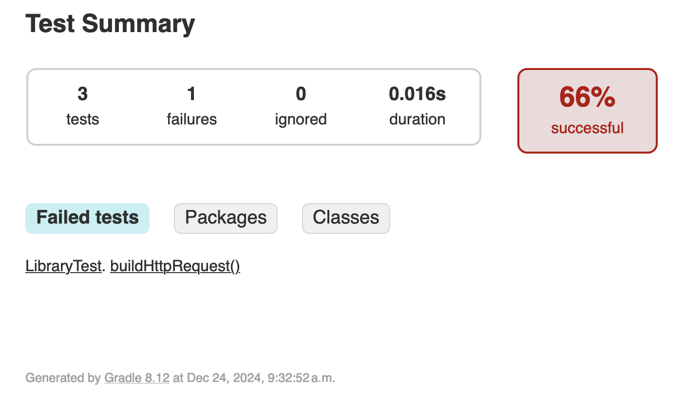

# NoobyAPI

## What is it

or better to say what does it try to accomplish? I want to send buch of request to some applications and pass the results to some other applications, they might be on the samee LAN or not, doesn't matter.
This library should Allow you to

- Send API request
- Receive Results
- Proccess them **by process I mean remove/modify some parameter based on a config file pass to it.**
- Pass the final result to the other endpoint
- Handle any error

## Is it the best solution? Why not use the other 1000 solutions?

I simply feel like an idiot using other ones tool. I want to gain a little bit of confedense and feel I accomplished something here.
Add a value ot the community!

## So are you gonna do all of it by your own?

umm, except some code lifting... yeeeesss... :)

## How I'm doing right now?

## This is part of the bigger project

explain later...

## TODO: udate the README later

## Log of what I did

# Start with Gradle project

- 

# smaller steps

- build the API
  - Authenticate
    - get user token
    - change it to base64
    - add it to the header
  - chose the API url based on documnetation
    - build an Enum of supported APIs of the given documnetation
  - Craft the packet to send

- send the request
- receive the response
- take appropriate actions

### Changes in the process

- at some point I need to convert the API documnetation to code and if it updates then I should update the code as well. Also, I had a lot of difficulties implementing them so, I decided to use .json file to load the documnetation and possibly make a github action to monitor the changes in that file in the wakapi repo so when it changed, update mine. Or maybe just update it whenever the user use the repo! I don't know now but let's see what will happen.
  - doc: <https://github.com/muety/wakapi/blob/master/static/docs/swagger.json>
  - What I ended up doing?

### Other resources that helped

- Failed to push quick fixes – The process '/usr/bin/gh' failed with exit code 1
  - solution: <https://stackoverflow.com/questions/72376229/github-actions-is-not-permitted-to-create-or-approve-pull-requests-createpullre/78864317#78864317>
